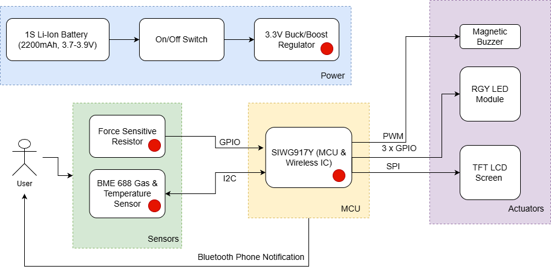
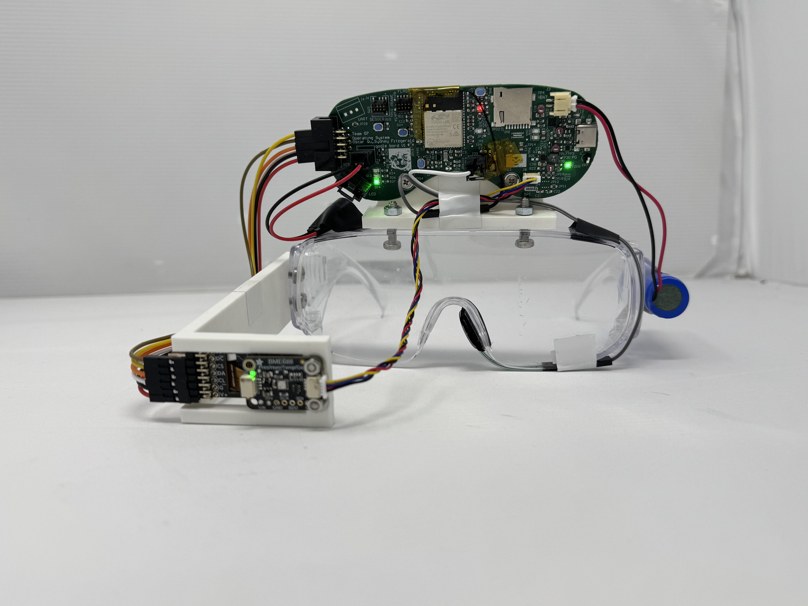
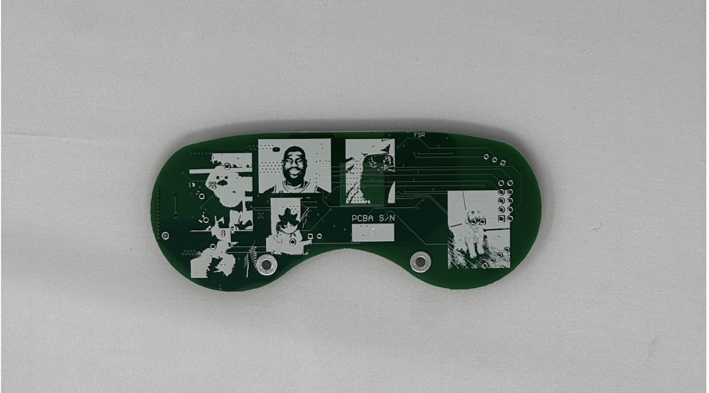
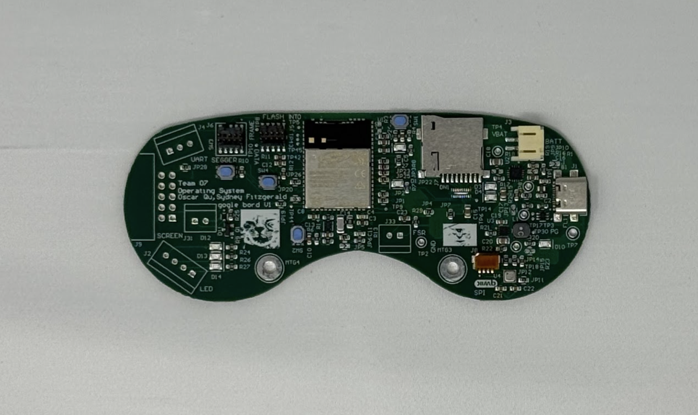
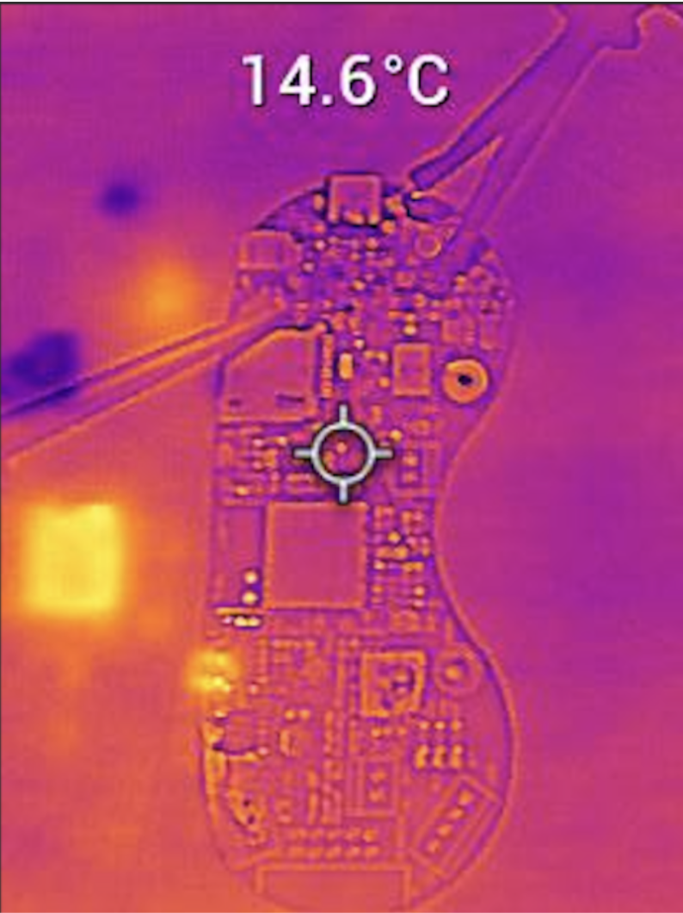
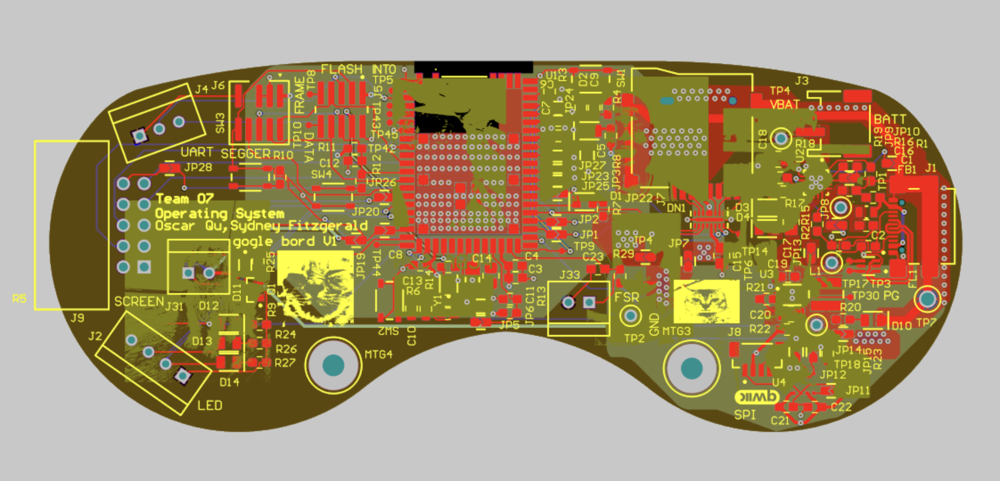
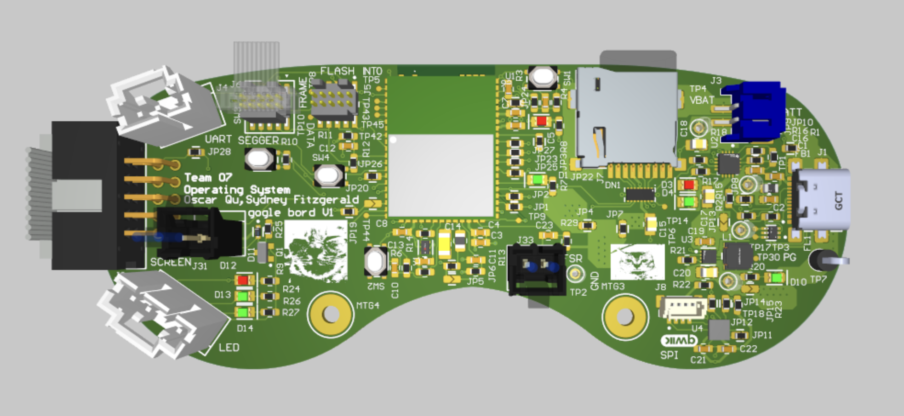
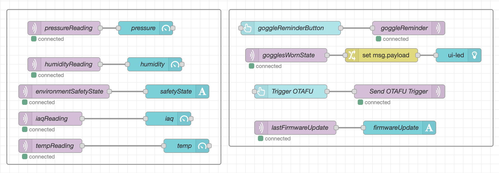
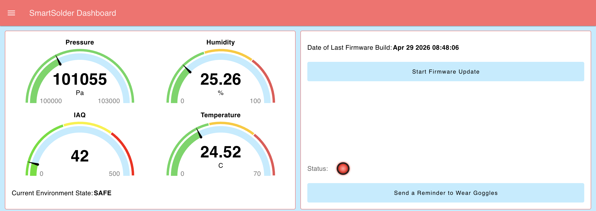

# a11g-final-submission

**Team Number: 07**

**Team Name: Operating System**

| Team Member Name  | Email Address          | GitHub Username |
| ----------------- | ---------------------- | --------------- |
| Sydney Fitzgerald | sydfitz@seas.upenn.edu | sydftz          |
| Oscar Qu          | oscarqu@seas.upenn.edu | yiyiqu          |

**GitHub Repository URL:** https://github.com/ese5160/a11g-final-submission-s26-s26-t07-operating-system

## 1. Video Presentation

https://youtu.be/M-YBCsFlFSY 

## 2. Project Summary

**Device Description:**

We created a pair of smart IOT safety googles for soldering, machining, or other engineering manufacturing tasks. These goggles are equipped with sensors and actuators to do live analysis on environmental conditions and alert the user of the surrounding conditions. We were inspired to do this project because, as electrical/computer engineers, we do a lot of soldering which can release toxic VOC's into the air. We wanted to create a tool that would allow us to see into the environmentla conditions such as air quality, temperature, and more. While we display the environmental conditions to a display mounted to the goggles, we also wirelessly send the information to our Node-RED dashboard which can be monitored anywhere in the world. Additionally, the dashboard itself can communicate to the goggles, such as sending a reminder to wear the goggles, triggering the buzzer and onboard LEDs, as well as over the air firmware updates.

**Device Functionality:**

Our device has two sensors, and three actuators. The two sensors, a force sensitive resistor mounted to the nosebridge of the goggle, and an I2C sensor which reads in gas quality, temperature, pressures, and humidity work together to read in the necessary information for our goggles. The force sensitive resistor is connected to a pullup resistor on the PCB to form a voltage divider. Using this conditioning circuit, we connected the middle node to an ADC pin on the MCU, allowing us to read in how much force was applied to the FSR. We then used this to set a threshold for detecting when the goggles were being worn, and this state was an MQTT task which is displayed on our internet conected dashboard via a status indicator LED. The gas sensor reads in information and sends it to our MCU over I2C. These variables are displayed on one of our actuators, a TFT LCD display, as well as onto our Node-RED dashboard.

We also have three actuators for live status indication and reporting. Our TFT LCD display is SPI controlled, and displays similar information available to the dashboard, but it is available right in front of the user's eye. We also have onboard LED indicators to display the environment state, which is connected to a state machine containing SAFE, WARNING, and UNSAFE. These are also communicated to the Node-RED dashboard. When the state is SAFE, the green LED on the board is on, WARNING switches it to yellow, and UNSAFE switches it to red and sounds the buzzer connected to the goggles.

While the onboard sensors communicate information to the Node-RED dashboard via MQTT tasks, the dashboard can also communicate to the board. A reminder to wear the goggles can be sent using a button on the dashboard, triggering the buzzer. We can also send over the air firmware updates to wirelessly update code within the MCU.

**Challenges**

One challenge we faced was with the PCB, where we had placed the sensor in the wrong orientation and gotten it assembled. We first tried to fix this by desoldering the sensor IC and replacing it with another one. However, the sensor was a component which had no leads, which would've made it difficult to resolder. Additionally, when removing the sensor, the casing on top of it came off first, exposing the wirebonded interior and possibly damaging it. To get past this, we decided to use the dev board and the qwiic connector we had added onto the board for debugging purposes. This ended up working out for the better, because the qwiic connector allowed us to extend the sensor in front of the goggle onto the screen mount, rather than placing it on the PCB where it would've been harder to detect the air quality.

On the firmware side, we faced many challenges when integrating all of the components together. All of the components which required installing new drivers and libraries: SPI screen, ADC, PWM, I2C sensor, all induced new challenges as they would reconfigure the pins or cause timing issues when integrated. Each additional component integrated required additional debugging, although we eventually got everything to work together. We had a bigger issue with our FSR, which was wired to ULP_GPIO_0. While this pin was capable of being set to an ADC pin, it was reserved for wifi tasks, and so we were unable to use it. To get around this, we had to add surgery onto our board by rewiring the FSR pin to ULP_GPIO_7, which had a test pad exposed for easier soldering. We also had to move the voltage divider and solder on a new header wire to connect to the FSR.

**Prototype Learnings**

In building this prototype, we learned a lot about designing for manufacturability and serviceability. Since our project had a lot of mechanical components to be integrated, including the FSR, goggles, buzzer, battery, and screen, there were a lot of things to take into account during the design phase. This included placing the connectors on our PCB strategically. As seen in our display, the 3D printed arm which mounts the screen and sensor dev board is mounted on the right side of the screen. The placement of the screen connector allows the wires to be routed along this arm and out of the way. On the other hand, the sensor ended up also being mounted to this arm, but that connector was in the middle of the board so the i2c wires are somewhat in the way of the user's vision.

If we had to build the device again, we would ensure that the sensor is orientated the right way during PCB assembly. We would also design more 3d printed mounts for cleaner mounting of the other components, such as the battery and buzzer which are currently taped on. We would also design the goggles to not be so front heavy. After assembling everything, we realized that the goggles were very heavy and easily fell off because the center of mass was towards the front. We would focus on decreasing mass and making it more balanced.

**Next Steps & Takeaways**

To improve the project, we could add more features between the on board MCU and the Node-RED dashboard to enable more functionality. Since the hardware and actuators all work properly, we could add more communication and features to add better modes of analysis or response. There are many ways to go with the dashboard, since the internet capabilities allow for many more features.

Through ESE5160, we learned a lot about designing an embedded system from start to finish. We learned how to select hardware components and connect and power everything together through a PCB, as well as proper engineering fundamentals when it comes to PCB design. The software connects everything together, and we learned the importance of features such as memory and flash within MCUs which enable flashing, processing, and over the air comunication. The topics covered during lecture such as the bootloader and cloud interfacing gave us new insight on the many possibilities with embedded systems, and how powerful projects can run off of tiny PCBs.

**Project Links**

Node-RED URL: [http://20.230.250.8:1880/dashboard/demo](http://20.230.250.8:1880/dashboard/demo)

Final PCBA: [https://upenn-eselabs.365.altium.com/designs/906A724F-71BC-4482-AF8C-505E2135AFCC?activeView=3D&amp;variant=[No+Variations]&amp;activeDocumentId=PCB-T07-Operating-System.PcbDoc#design](https://upenn-eselabs.365.altium.com/designs/906A724F-71BC-4482-AF8C-505E2135AFCC?activeView=3D&variant=[No+Variations]&activeDocumentId=PCB-T07-Operating-System.PcbDoc#design)

## 3. Hardware & Software Requirements

| ID     | Description                                                                                                                                                                                                                                                                      |
| ------ | -------------------------------------------------------------------------------------------------------------------------------------------------------------------------------------------------------------------------------------------------------------------------------- |
| HRS-01 | A force sensing resistor shall be used for detecting when the goggles are worn. The force sensing resistor shall detect forces in the range from 0N to 5N with a resolution of ±0.5N, and it will detect the goggles being worn when the force sensor detects a force of >= 2N. |
| HRS-02 | The voltage across the force sensing resistor shall be measured with an ADC resolution of 4096 for accurate pressure reading.                                                                                                                                                    |
| HRS-03 | A gas sensor sensor shall detect when VOCs are present in front of the goggles. The IAQ should have an output between 0 to 500 with a resolution of 1 to indicate air quality.                                                                                                   |
| HRS-04 | A temperature sensor should monitor the ambient temperature between 20°C to 100°C with an accuracy of ±1.0°C.                                                                                                                                                                |
| HRS-05 | A buzzer shall be used to indicate unsafe environmental conditions. The buzzer shall sound at a minimum of 20 dB when it is actuated, at a frequency of 1Hz.                                                                                                                     |
| HRS-06 | Three on board LEDs shall display red, yellow, or green colors to indicate the safety conditions of the environment. Only one of these such LEDs shall be lit at any time to indicate status.                                                                                    |
| HRS-07 | An LCD screen should constantly be displaying live environmental conditions, including the temperature and air quality. The latency between measurement to display should be less than 200 milliseconds.                                                                         |
| HRS-08 | The LCD display should update with new data from the BME688 sensor every 150 ms.                                                                                                                                                                                                 |

| ID     | Description                                                                                                                                                  |
| ------ | ------------------------------------------------------------------------------------------------------------------------------------------------------------ |
| SRS-01 | The information from the gas and temperature sensors in the BME688 shall be sampled at a rate of 2Hz.                                                       |
| SRS-02 | The force sensor shall be sampled at a rate of 10 Hz.                                                                                                        |
| SRS-03 | When the index air quality crosses at least 200, a flag shall be raised which triggers the buzzer and turns the LED red within 1 second.                     |
| SRS-04 | The LEDs should be updated within 100ms of an air quality status change, displaying green, yellow, or red according to current air quality.                  |
| SRS-05 | The screen should display the temperature and air quality data at 260 ppi within the 240x135 constraints at a refresh rate of at least 24Hz.                 |
| SRS-06 | The MCU should provide feedback via a Node-RED webpage dashboard about the environmental conditions, notifying the user within 100ms if conditions change. |
| SRS-07 | A trigger shall be sent via MQTT if a user presses the goggle reminder buzzer on the dashboard, enabling the buzzer & flashing LED routine within 500 ms.    |
| SRS-08 | A trigger shall be sent via MQTT if a user presses the OTA firmware button on the dashboard, the update shall be intiated on the device within 500 ms.       |

## 4. Project Photos & Screenshots

## 5. Codebase

Do *not* commit any of your source code to this repository. Rather, provide links to the other GitHub repository you've already been using with your firmware.

- A link to your final embedded C firmware codebases

  - Codebase located here: [https://github.com/ese5160/final-project-firmware-s26-t07-operating-system](https://github.com/ese5160/final-project-firmware-s26-t07-operating-system)
- A link to your Node-RED dashboard code

  - Dashboard:[http://20.230.250.8:1880/dashboard/demo](http://20.230.250.8:1880/dashboard/demo)
